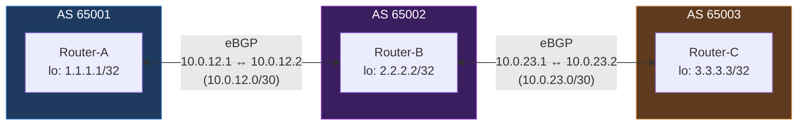
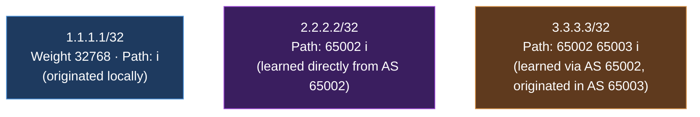

# Homelab Project: BGP Routing Lab (FRRouting)

> Personal homelab project implementing eBGP peering across three simulated Autonomous Systems using FRRouting, built on the same topology as the OSPF lab, demonstrating AS-Path propagation and RFC 8212 default policy behavior.

## 📋 Overview

This project reconfigures the 3-router topology from the OSPF lab into three separate Autonomous Systems (AS 65001, 65002, 65003), establishing eBGP sessions between adjacent routers to demonstrate how BGP learns and propagates routes across AS boundaries — including transit routing, where Router-A learns Router-C's route *through* Router-B's AS path.

## 🏗️ Architecture

**Route propagation observed on Router-A:**

The AS-Path attribute (`65002 65003`) is the core mechanism that distinguishes BGP from an IGP like OSPF — it records every AS a route has traversed, which both prevents routing loops (a router rejects any route containing its own AS number) and gives visibility into how many networks a path crosses.

## 🛠️ Tech Stack

| Component | Technology |
|---|---|
| Hypervisor | Proxmox VE |
| Router OS | Ubuntu Server (minimal install) |
| Routing Software | FRRouting (FRR) — same 3-VM topology reused from the OSPF lab |
| Management CLI | `vtysh` (Cisco IOS-style syntax) |

## ✅ What Was Implemented

### 1. Protocol Transition
- Disabled OSPF (`no router ospf`) on all three routers to avoid control-plane conflicts
- Enabled the `bgpd` daemon in `/etc/frr/daemons` and restarted FRR on all three nodes

### 2. eBGP Configuration
- Assigned each router its own AS number (65001, 65002, 65003)
- Configured `neighbor <remote-IP> remote-as <AS>` on each router, peering with the adjacent router across each existing point-to-point link
- Advertised each router's loopback into BGP via `network X.X.X.X/32` under `address-family ipv4 unicast`

### 3. RFC 8212 Default Policy Compliance
- Created an explicit `route-map ALLOW-ALL permit 10` and applied it as both inbound and outbound policy on every eBGP neighbor, satisfying FRR's default requirement (RFC 8212) that eBGP sessions have an explicit policy before routes are exchanged

### 4. Verification
- Confirmed all three BGP sessions reached **Established** state with real prefix counts (not `(Policy)`)
- Confirmed Router-A's BGP table (`show ip bgp`) contained all three loopback prefixes, with the correct AS-Path for each — directly-originated, one-hop-learned, and two-hop-transit routes all visible and distinguishable
- Confirmed the same symmetric behavior on Router-B and Router-C, each showing the other two routers' prefixes with appropriate AS-Path values

## 🐛 Problems Encountered & Solutions

### Problem 1: Local vs. Remote IP Confusion in Neighbor Statements
- **Symptom:** Router-B's `neighbor 10.0.23.1 remote-as 65003` command was rejected with `% Can not configure the local system as neighbor`
- **Cause:** `10.0.23.1` was Router-B's *own* IP address on that link — the neighbor statement must point to the IP of the router on the *other end* of the link, which was `10.0.23.2` (Router-C's address on that subnet). This same category of mistake (local vs. remote address) recurred across multiple routers during configuration, compounded by a typo pattern of `10.10.x.x` instead of `10.0.x.x`.
- **Solution:** Cross-checked each router's actual assigned IP via `ip a` before writing neighbor statements, and corrected each `neighbor` line to reference the adjacent router's real address
- **Lesson:** For point-to-point BGP/routing configuration, always verify the *far-end* address directly (via `ip a` on the neighbor itself) rather than assuming it from the addressing scheme on paper — a single-digit typo (`10.0` vs `10.10`) produces a config that looks superficially correct but silently fails.

### Problem 2: BGP Sessions Established But Showing `(Policy)` Instead of Prefix Counts
- **Symptom:** `show ip bgp summary` showed all sessions Established with valid Up/Down timers, but the `State/PfxRcd` column displayed `(Policy)` instead of a route count, and no prefixes appeared in `show ip bgp` from any neighboring AS
- **Diagnosis:** Researched FRR's default eBGP behavior and found that modern FRR versions enforce RFC 8212: an eBGP session with no explicit inbound/outbound route policy will establish the TCP session and exchange capabilities, but will not accept or advertise any prefixes at all, displaying `(Policy)` as an explicit signal that a policy is missing — this is a deliberate safety default to prevent accidental route leaks between autonomous systems, not a misconfiguration in the traditional sense
- **Solution:** Created a permissive `route-map ALLOW-ALL permit 10` and applied it as both `in` and `out` policy on every eBGP neighbor across all three routers
- **Lesson:** Initially attempted to fix this by adding `neighbor ... activate` under the address-family — this had no effect and didn't even appear in the saved config, because `frr defaults traditional` already auto-activates the IPv4 unicast address-family for configured neighbors, making that command a no-op in this context. The real fix required addressing the RFC 8212 policy requirement specifically, not address-family activation.

### Problem 3: Loopback Addresses Disappeared After VM Reboot, Silently Breaking Route Advertisement
- **Symptom:** After route-maps were correctly applied and sessions were confirmed Established, prefixes were still not being advertised — `show ip bgp` on every router showed only its own locally-originated route, with no prefixes received from neighbors
- **Diagnosis:** Checked each router's routing table (`show ip route`) and found the loopback addresses (`1.1.1.1/32`, `2.2.2.2/32`, `3.3.3.3/32`) were completely absent — they had been added earlier with `ip addr add ... dev lo`, a non-persistent command, and were lost across a VM reboot performed while troubleshooting earlier BGP config issues
- **Solution:** Re-added each loopback address, and this time made them persistent by adding a `lo:` stanza with the address directly in each router's Netplan configuration file
- **Lesson:** Since FRR (v7.4+) requires a `network` statement's prefix to actually exist in the local RIB before it will be advertised via BGP, a routing configuration that looks completely correct can silently fail to advertise anything if the underlying interface address it depends on was never made persistent. This is conceptually similar to the OSPF lab's IP-forwarding issue — a control-plane configuration succeeding doesn't guarantee the data it depends on is actually present.

## 🎯 Skills Demonstrated

- eBGP configuration across multiple Autonomous Systems using production routing software (FRR)
- Understanding and applying RFC 8212 (default eBGP policy requirement) and route-map based policy configuration
- Reading and interpreting AS-Path attributes to distinguish directly-originated, single-hop, and transit routes
- Systematic troubleshooting across three distinct root causes affecting the same symptom (missing prefixes) — address misconfiguration, missing policy, and a non-persistent interface configuration — each diagnosed independently before being resolved
- Recognizing when a fix attempt is actually a no-op (address-family activation under `frr defaults traditional`) by checking the saved running-config rather than assuming success from the command executing without error

