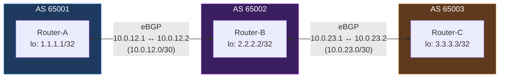

# โปรเจกต์ Homelab: BGP Routing Lab (FRRouting)

> โปรเจกต์ Homelab ส่วนตัวที่ Implement eBGP Peering ข้าม 3 Autonomous System จำลองโดยใช้ FRRouting สร้างบนโทโพโลยีเดียวกับแล็บ OSPF เพื่อสาธิตการแพร่กระจาย AS-Path และพฤติกรรม Default Policy ตาม RFC 8212

## 📋 ภาพรวม

โปรเจกต์นี้ปรับโทโพโลยีเราเตอร์ 3 ตัวจากแล็บ OSPF ใหม่ให้เป็น 3 Autonomous System แยกกัน (AS 65001, 65002, 65003) และสร้าง eBGP Session ระหว่างเราเตอร์ที่อยู่ติดกัน เพื่อสาธิตว่า BGP เรียนรู้และแพร่กระจาย Route ข้ามขอบเขต AS ได้อย่างไร — รวมถึง Transit Routing ที่ Router-A เรียนรู้ Route ของ Router-C *ผ่าน* AS Path ของ Router-B

## 🏗️ สถาปัตยกรรม

**การแพร่กระจาย Route ที่สังเกตเห็นบน Router-A:**

AS-Path Attribute (`65002 65003`) คือกลไกหลักที่แยก BGP จาก IGP อย่าง OSPF — มันบันทึกทุก AS ที่ Route ผ่าน ซึ่งทั้งป้องกัน Routing Loop (เราเตอร์จะปฏิเสธ Route ที่มี AS ของตัวเองอยู่ใน Path) และให้มองเห็นได้ว่า Path ผ่านเครือข่ายกี่แห่ง

## 🛠️ เทคโนโลยีที่ใช้

| ส่วนประกอบ | เทคโนโลยี |
|---|---|
| Hypervisor | Proxmox VE |
| Router OS | Ubuntu Server (ติดตั้งแบบ Minimal) |
| Routing Software | FRRouting (FRR) — ใช้โทโพโลยี 3 VM เดิมจากแล็บ OSPF |
| Management CLI | `vtysh` (Syntax แบบ Cisco IOS) |

## ✅ สิ่งที่ทำสำเร็จ

### 1. การเปลี่ยน Protocol
- ปิดใช้งาน OSPF (`no router ospf`) บนเราเตอร์ทั้งสามตัวเพื่อหลีกเลี่ยงความขัดแย้งระหว่าง Control-Plane
- เปิดใช้งาน Daemon `bgpd` ใน `/etc/frr/daemons` และรีสตาร์ท FRR บนทั้งสามโหนด

### 2. การตั้งค่า eBGP
- กำหนด AS Number ของแต่ละเราเตอร์ (65001, 65002, 65003)
- ตั้งค่า `neighbor <remote-IP> remote-as <AS>` บนแต่ละเราเตอร์ โดย Peer กับเราเตอร์ที่อยู่ติดกันข้าม Link แบบ Point-to-Point ที่มีอยู่แล้ว
- Advertise Loopback ของแต่ละเราเตอร์เข้า BGP ผ่าน `network X.X.X.X/32` ภายใต้ `address-family ipv4 unicast`

### 3. การปฏิบัติตาม RFC 8212 Default Policy
- สร้าง `route-map ALLOW-ALL permit 10` และใช้เป็น Policy ทั้ง Inbound และ Outbound บน Neighbor eBGP ทุกตัว เพื่อให้ตรงตามข้อกำหนดของ FRR (RFC 8212) ที่ว่า eBGP Session ต้องมี Policy ชัดเจนก่อนจึงจะแลกเปลี่ยน Route ได้

### 4. การตรวจสอบ
- ยืนยันว่า BGP Session ทั้งสามถึงสถานะ **Established** พร้อม Prefix Count จริง (ไม่ใช่ `(Policy)`)
- ยืนยันว่า BGP Table ของ Router-A (`show ip bgp`) มี Loopback Prefix ทั้งสาม พร้อม AS-Path ที่ถูกต้องสำหรับแต่ละตัว — Route ที่ออกจากต้นทางโดยตรง, เรียนรู้แบบ One-Hop และ Two-Hop Transit ทั้งหมดมองเห็นได้และแยกแยะได้
- ยืนยันพฤติกรรม Symmetric เดียวกันบน Router-B และ Router-C แต่ละตัวแสดง Prefix ของเราเตอร์อีกสองตัวพร้อมค่า AS-Path ที่เหมาะสม

## 🐛 ปัญหาที่พบและวิธีแก้ไข

### ปัญหาที่ 1: สับสนระหว่าง IP ฝั่งตัวเองกับฝั่ง Remote ใน Neighbor Statement
- **อาการ:** คำสั่ง `neighbor 10.0.23.1 remote-as 65003` ของ Router-B ถูกปฏิเสธด้วย `% Can not configure the local system as neighbor`
- **สาเหตุ:** `10.0.23.1` เป็น IP ของ Router-B *เอง* บน Link นั้น — Neighbor Statement ต้องชี้ไปที่ IP ของเราเตอร์ *ปลายทางอีกฝั่ง* ซึ่งคือ `10.0.23.2` (ที่อยู่ของ Router-C บน Subnet นั้น) ความผิดพลาดประเภทเดียวกันนี้ (Local vs Remote Address) เกิดขึ้นซ้ำในเราเตอร์หลายตัวระหว่างการตั้งค่า รวมกับรูปแบบการพิมพ์ผิดของ `10.10.x.x` แทนที่จะเป็น `10.0.x.x`
- **วิธีแก้:** ตรวจสอบ IP จริงของแต่ละเราเตอร์ผ่าน `ip a` ก่อนเขียน Neighbor Statement และแก้ไขแต่ละบรรทัด `neighbor` ให้อ้างถึงที่อยู่จริงของเราเตอร์ที่อยู่ติดกัน
- **บทเรียน:** สำหรับการตั้งค่า BGP/Routing แบบ Point-to-Point ควรตรวจสอบที่อยู่ *ปลายทางอีกฝั่ง* โดยตรง (ผ่าน `ip a` บน Neighbor เอง) แทนที่จะสมมติจากแผน Addressing บนกระดาษ — การพิมพ์ผิดแค่หลักเดียว (`10.0` กับ `10.10`) ทำให้ได้ Config ที่ดูถูกต้องในรูปลักษณ์แต่ล้มเหลวโดยไม่มีการแจ้งเตือน

### ปัญหาที่ 2: BGP Session Established แต่แสดง `(Policy)` แทนที่จะเป็นจำนวน Prefix
- **อาการ:** `show ip bgp summary` แสดง Session ทั้งหมดเป็น Established พร้อม Timer Up/Down ที่ถูกต้อง แต่คอลัมน์ `State/PfxRcd` แสดง `(Policy)` แทนจำนวน Route และไม่มี Prefix ปรากฏใน `show ip bgp` จาก AS ที่อยู่ติดกันเลย
- **การวินิจฉัย:** ค้นคว้าพฤติกรรมเริ่มต้นของ FRR สำหรับ eBGP และพบว่า FRR เวอร์ชันสมัยใหม่บังคับใช้ RFC 8212: eBGP Session ที่ไม่มี Inbound/Outbound Route Policy ชัดเจนจะสร้าง TCP Session และแลกเปลี่ยน Capability ได้ แต่จะไม่รับหรือ Advertise Prefix ใดๆ เลย โดยแสดง `(Policy)` เป็นสัญญาณชัดเจนว่าขาด Policy — นี่เป็น Default ด้านความปลอดภัยโดยตั้งใจเพื่อป้องกันการรั่วไหลของ Route ระหว่าง AS โดยไม่ตั้งใจ ไม่ใช่การตั้งค่าผิดพลาดในแบบดั้งเดิม
- **วิธีแก้:** สร้าง `route-map ALLOW-ALL permit 10` แบบ Permissive และใช้เป็น Policy `in` และ `out` บน Neighbor eBGP ทุกตัวในทุกเราเตอร์
- **บทเรียน:** เริ่มแรกพยายามแก้ไขโดยเพิ่ม `neighbor ... activate` ภายใต้ Address-Family — ไม่มีผลและไม่ปรากฏใน Config ที่บันทึกด้วยซ้ำ เพราะ `frr defaults traditional` Auto-Activate IPv4 Unicast Address-Family สำหรับ Neighbor ที่ตั้งค่าไว้แล้ว ทำให้คำสั่งนั้นไม่มีผลใดๆ การแก้ไขที่แท้จริงต้องการการจัดการข้อกำหนด Policy ของ RFC 8212 โดยเฉพาะ ไม่ใช่การ Activate Address-Family

### ปัญหาที่ 3: Loopback Address หายไปหลัง VM Reboot ทำให้การ Advertise Route ล้มเหลวโดยไม่มีการแจ้งเตือน
- **อาการ:** หลังจากใช้ Route-Map อย่างถูกต้องและยืนยัน Session เป็น Established แล้ว Prefix ยังคงไม่ถูก Advertise — `show ip bgp` บนทุกเราเตอร์แสดงเฉพาะ Route ที่ออกจากต้นทางโดยตรงของตัวเอง โดยไม่มี Prefix ที่ได้รับจาก Neighbor
- **การวินิจฉัย:** ตรวจสอบ Routing Table ของแต่ละเราเตอร์ (`show ip route`) และพบว่าที่อยู่ Loopback (`1.1.1.1/32`, `2.2.2.2/32`, `3.3.3.3/32`) หายไปทั้งหมด — เพิ่มไว้ก่อนหน้านี้ด้วย `ip addr add ... dev lo` ซึ่งเป็นคำสั่งแบบไม่ถาวร และหายไปเมื่อ VM Reboot ระหว่างการแก้ไขปัญหา Config BGP ก่อนหน้า
- **วิธีแก้:** เพิ่มที่อยู่ Loopback ใหม่ และคราวนี้ทำให้ถาวรโดยเพิ่ม Stanza `lo:` พร้อมที่อยู่โดยตรงในไฟล์ Netplan Configuration ของแต่ละเราเตอร์
- **บทเรียน:** เนื่องจาก FRR (v7.4+) ต้องการให้ Prefix ใน `network` Statement มีอยู่จริงใน Local RIB ก่อนจึงจะ Advertise ผ่าน BGP ได้ การตั้งค่า Routing ที่ดูถูกต้องสมบูรณ์อาจล้มเหลวในการ Advertise อะไรเลยโดยไม่มีเสียงหากที่อยู่ Interface ที่ขึ้นอยู่กับมันไม่เคยถูกทำให้ถาวร แนวคิดนี้คล้ายกับปัญหา IP-Forwarding ในแล็บ OSPF — การที่ตั้งค่า Control-Plane สำเร็จไม่รับประกันว่าข้อมูลที่ขึ้นอยู่กับมันมีอยู่จริง

## 🎯 ทักษะที่ได้รับ

- การตั้งค่า eBGP ข้าม Autonomous System หลายแห่งโดยใช้ซอฟต์แวร์ Routing ระดับ Production (FRR)
- การเข้าใจและประยุกต์ใช้ RFC 8212 (ข้อกำหนด Default eBGP Policy) และการตั้งค่า Policy แบบ Route-Map
- การอ่านและตีความ AS-Path Attribute เพื่อแยกแยะ Route ที่ออกจากต้นทางโดยตรง, แบบ Single-Hop และแบบ Transit
- การแก้ปัญหาอย่างเป็นระบบข้าม 3 Root Cause ที่แตกต่างกันซึ่งส่งผลต่อ Symptom เดียวกัน (Prefix หายไป) — การตั้งค่า Address ผิด, Policy ขาด และ Interface Config ที่ไม่ถาวร — แต่ละอย่างวินิจฉัยแยกกันก่อนแก้ไข
- การรู้จักเมื่อการแก้ไขที่พยายามไม่มีผลจริง (Address-Family Activation ภายใต้ `frr defaults traditional`) โดยตรวจสอบ Running-Config ที่บันทึกไว้แทนที่จะสมมติว่าสำเร็จจากการที่คำสั่งทำงานโดยไม่มี Error
