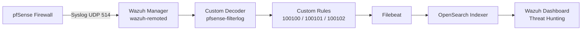

# pfSense → Wazuh SIEM Integration Lab

Network security monitoring lab integrating pfSense firewall logs with Wazuh SIEM/XDR for real-time firewall event analysis, custom detection rules, and dashboard visualization.

## Overview

This lab implements a full syslog-based log pipeline from a pfSense firewall into a Wazuh manager, with custom decoders and rules to parse pfSense's `filterlog` format, generate meaningful alerts (including basic port-scan detection), and visualize the results in Wazuh's OpenSearch Dashboards.



## Environment

| Component | Details |
|---|---|
| Wazuh Manager | Ubuntu Server 22.04, Wazuh 4.14.6 (all-in-one install) |
| Wazuh Manager IP | `10.10.10.50/24` (dedicated NIC on lab subnet) |
| pfSense | Community Edition, LAN `10.10.10.1/24` |
| Hypervisor | Proxmox VE |
| Syslog transport | UDP, port 514 |

Both VMs run on Proxmox with a second NIC added to the Wazuh VM specifically to join the `10.10.10.0/24` lab subnet (the manager's primary NIC remains on the home network `192.168.1.0/24` for management access).

## 1. Network Prerequisites

The Wazuh manager needs a network path to pfSense's LAN interface. In this lab, that meant adding a second virtual NIC to the Wazuh VM in Proxmox, bridged to the same vSwitch as pfSense's LAN interface, with a static IP in the lab subnet.

**Netplan config** (`/etc/netplan/00-installer-config.yaml`):

```yaml
network:
  version: 2
  renderer: networkd
  ethernets:
    ens18:
      dhcp4: true
    ens19:
      addresses:
        - 10.10.10.50/24
      dhcp4: false
```

> **Note:** `renderer: networkd` matters — without it, some Ubuntu images let NetworkManager race with netplan-generated systemd-networkd on boot, silently reverting the static IP back to DHCP after a reboot.

Verify connectivity before proceeding:

```bash
ping -c 4 10.10.10.1     # from Wazuh to pfSense
```

## 2. pfSense: Remote Logging Configuration

**Status > System Logs > Settings**

| Setting | Value |
|---|---|
| Enable Remote Logging | ✅ |
| Remote log servers | `10.10.10.50:514` |
| Remote Syslog Contents | ✅ System Events, ✅ Firewall Events, ✅ DHCP Events |

pfSense sends syslog as plain UDP datagrams to port 514 on the target — no additional service needs to be running on the pfSense side.

## 3. Wazuh Manager: Syslog Listener

Wazuh does not accept raw syslog by default — it must be explicitly configured as a second `<remote>` block in `ossec.conf` (the default block already handles agent traffic on port 1514/tcp).

**`/var/ossec/etc/ossec.conf`** — appended block:

```xml
<ossec_config>
  <remote>
    <connection>syslog</connection>
    <port>514</port>
    <protocol>udp</protocol>
    <allowed-ips>10.10.10.1</allowed-ips>
  </remote>
</ossec_config>
```

For debugging during setup, `logall`/`logall_json` were temporarily enabled in the first `<global>` block to capture all incoming events (not just alerts) into `archives.log`/`archives.json`:

```xml
<logall>yes</logall>
<logall_json>yes</logall_json>
```

Verify the listener is bound:

```bash
sudo ss -ulnp | grep 514
# UNCONN 0 0 0.0.0.0:514 0.0.0.0:* users:(("wazuh-remoted",pid=...))
```

## 4. Custom Decoder

pfSense's `filterlog` is a fixed-position CSV payload appended after the syslog header, e.g.:

```
filterlog[70751]: 4,,,1000000103,vtnet0,match,block,in,4,0x0,,1,20027,0,none,17,udp,198,192.168.1.8,239.255.255.250,52197,1900,178
```

**`/var/ossec/etc/decoders/local_decoder.xml`:**

```xml
<decoder name="pfsense-filterlog">
  <prematch>filterlog</prematch>
</decoder>

<decoder name="pfsense-filterlog-fields">
  <parent>pfsense-filterlog</parent>
  <regex type="pcre2">filterlog\[\d+\]: \d*,[^,]*,[^,]*,\d+,([^,]+),([^,]+),([^,]+),([^,]+),\d+,[^,]*,[^,]*,\d+,\d+,\d+,[^,]*,\d+,([^,]+),\d+,([^,]+),([^,]+),(\d+),(\d+)</regex>
  <order>interface,reason,fw_action,direction,protocol,srcip,dstip,srcport,dstport</order>
</decoder>
```

Fields extracted: `interface`, `reason`, `fw_action`, `direction`, `protocol`, `srcip`, `dstip`, `srcport`, `dstport`.

Currently scoped to **IPv4** traffic only — IPv6 `filterlog` entries use a different field layout and fall back to the parent decoder (alert still fires, but without parsed fields).

### Pitfalls hit along the way

- **`program_name` never matched.** Because the syslog forwarding path (`wazuh->10.10.10.1 ...`) prefixes the line in a non-standard way, Wazuh's pre-decoder couldn't extract a clean `program_name`. Switched from `<program_name>` matching to `<prematch>filterlog</prematch>`, which just checks the string appears anywhere in the line.
- **OS_Regex vs PCRE2.** Wazuh's default regex engine (OS_Regex) doesn't support PCRE character classes or escaped brackets (`\[`, `\]`, `[^,]`). Syntax that's valid PCRE threw `ERROR (1452): Syntax error on regex`. Switching to `<regex type="pcre2">` unlocked full character-class support.
- **`action` is a reserved field name.** Wazuh's active-response subsystem reserves `action` internally; naming a decoder field `action` throws `Field 'action' is static.` at rule-load time. Renamed to `fw_action`.
- **`use_own_name` defaults to `no`.** A child decoder inherits the parent's *name* for rule-matching purposes unless `<use_own_name>yes</use_own_name>` is set — even though its own regex/fields are what actually get applied. Rules written against the child's name silently never matched. Fixed by pointing `<decoded_as>` at the parent name instead.

## 5. Custom Rules

**`/var/ossec/etc/rules/local_rules.xml`:**

```xml
<group name="pfsense,firewall,">
  <rule id="100100" level="3">
    <decoded_as>pfsense-filterlog</decoded_as>
    <description>pfSense: Firewall log event</description>
  </rule>

  <rule id="100101" level="6">
    <if_sid>100100</if_sid>
    <field name="fw_action">block</field>
    <description>pfSense: Traffic blocked by firewall ($(srcip) -> $(dstip):$(dstport))</description>
  </rule>

  <rule id="100102" level="10" frequency="10" timeframe="60">
    <if_matched_sid>100101</if_matched_sid>
    <description>pfSense: Possible port scan - multiple blocked connections</description>
    <mitre>
      <id>T1046</id>
    </mitre>
  </rule>
</group>
```

| Rule ID | Level | Trigger |
|---|---|---|
| 100100 | 3 | Any decoded pfSense filterlog event |
| 100101 | 6 | `fw_action == block` — logs source/destination directly in the description |
| 100102 | 10 | 10+ blocked events from the same source within 60s → possible port scan (MITRE T1046) |

Always validate config before restarting the service:

```bash
sudo /var/ossec/bin/wazuh-analysisd -t
sudo systemctl restart wazuh-manager
```

### Interactive testing with `wazuh-logtest`

Before trusting a decoder/rule change to live traffic, test it directly:

```bash
sudo /var/ossec/bin/wazuh-logtest
```

Paste a real captured line and confirm all three phases complete:

```
**Phase 2: Completed decoding.
    srcip: '192.168.1.8'
    dstip: '239.255.255.250'
    srcport: '52197'
    dstport: '1900'
    fw_action: 'block'

**Phase 3: Completed filtering (rules).
    id: '100101'
    level: '6'
    description: 'pfSense: Traffic blocked by firewall (192.168.1.8 -> 239.255.255.250:1900)'
**Alert to be generated.
```

## 6. Verification Path

Debugging this pipeline end-to-end required checking each hop independently rather than assuming the whole chain worked:

```bash
# 1. Network reachability
ping -c 4 10.10.10.1

# 2. Packets actually arriving at the manager
sudo tcpdump -i any udp port 514 -n

# 3. Wazuh remoted received + archived it (before any decoder/rule logic)
sudo tail -f /var/ossec/logs/archives/archives.log | grep -i filterlog

# 4. Decoder + rule fired
sudo tail -f /var/ossec/logs/alerts/alerts.json | grep -i pfsense

# 5. Filebeat → indexer pipeline is healthy
sudo systemctl status filebeat
sudo filebeat test output
```

> **Indexer inventory warnings are a red herring.** During setup, `ossec.log` showed persistent `IndexerConnector initialization failed for index 'wazuh-states-inventory-*'` warnings. These relate to the separate vulnerability-detection/inventory feature and do **not** affect the main `wazuh-alerts-*` pipeline used by Threat Hunting — that path runs through Filebeat independently. Don't chase these warnings when debugging missing alerts in the dashboard.

## 7. Dashboard

Built in **OpenSearch Dashboards → Visualize**, index pattern `wazuh-alerts-*`:

| Visualization | Type | Config |
|---|---|---|
| `pfsense_top_blocked_srcip` | Bar/Pie | Terms on `data.srcip`, size 10, filtered `rule.id: 100101` |
| `pfsense_top_blocked_port` | Vertical Bar | Terms on `data.dstport`, size 10 |
| `pfsense_alert_timeline` | Area/Line | Date Histogram on `timestamp`, split series Terms on `rule.id` |

Combined into a single dashboard: **pfSense Firewall Monitoring**.

### Observed results (first 24h)

- Top blocked ports were `1900` (SSDP/UPnP), `5353` (mDNS/Bonjour), and `57621` (Spotify Connect discovery) — all normal home-network discovery broadcast traffic being caught by pfSense's default deny rule, not malicious activity.
- Traffic peaked between 18:00–21:00, consistent with more devices being active on the home network in the evening.
- This is a useful reminder that **volume ≠ threat** — rule 100102's frequency threshold (10 events/60s) will need tuning (e.g., excluding known discovery ports) to avoid false-positive "port scan" alerts on ordinary broadcast noise.

## Troubleshooting Log

A detailed, chronological record of every issue hit during this lab and how it was resolved — kept for future reference since several of these are easy to hit again.

### Issue 1: `wazuh-manager.service` failed to start after adding the decoder

**Symptom:**
```
wazuh-analysisd: ERROR: (1452): Syntax error on regex: 'filterlog\[\d+\]: (\S+)'
wazuh-analysisd: CRITICAL: (1202): Configuration error at 'etc/decoders/local_decoder.xml'.
```

**Cause:** Wazuh's default regex engine (OS_Regex) does not support PCRE syntax like `\d`, `\S`, or escaped brackets `\[`/`\]`. Any of these threw a syntax error and prevented the manager from starting at all.

**Fix:** Initially simplified the regex to avoid brackets/shorthand classes entirely (`: (.+)`). Later, once field-level parsing was needed, switched to `<regex type="pcre2">` on the decoder, which enables full PCRE2 support including character classes.

**Prevention:** Always validate config changes *before* restarting the service:
```bash
sudo /var/ossec/bin/wazuh-analysisd -t
```

---

### Issue 2: pfSense syslog never reached Wazuh — `192.168.1.1` collided with the home router

**Symptom:** After a pfSense factory reset, its default LAN IP (`192.168.1.1`) was identical to the home router's IP, making the pfSense web UI unreachable over LAN.

**Cause:** Factory-reset pfSense always defaults LAN to `192.168.1.1/24`, which happened to match the existing home network.

**Fix:** Used the pfSense console menu (option `2) Set interface(s) IP address`) to directly reassign the LAN interface to `10.10.10.1/24` — bypassing the web UI entirely since it wasn't reachable yet.

---

### Issue 3: Wazuh VM and pfSense could not reach each other at all

**Symptom:** `ping 10.10.10.1` from Wazuh failed completely; `ip a` showed the Wazuh VM only had an interface on `192.168.1.0/24`.

**Cause:** The Wazuh VM had never been connected to the lab subnet (`10.10.10.0/24`) at the virtual network layer — it only ever had one NIC, on the home network.

**Fix:** Added a second virtual NIC to the Wazuh VM in Proxmox, bridged to the same vSwitch pfSense's LAN uses, then assigned it a static IP via netplan (see [Section 1](#1-network-prerequisites)).

---

### Issue 4: New NIC came up with a DHCP-leased IP instead of the static IP in netplan

**Symptom:** `ip a` showed `ens19` with IP `10.10.10.103/24` and a `valid_lft` counting down — despite `/etc/netplan/*.yaml` explicitly specifying `10.10.10.50/24` with `dhcp4: false`.

**Cause:** The netplan file was correct on disk but had never actually been applied — the interface had picked up whatever the DHCP server on that subnet offered when it first came up.

**Fix:**
```bash
sudo netplan apply
# if that doesn't take effect immediately:
sudo ip addr flush dev ens19
sudo netplan apply
```

---

### Issue 5: Static IP reverted to DHCP again after a VM reboot

**Symptom:** After stopping/starting the VM, `ens19` came back up on a DHCP lease again, breaking the syslog path until re-fixed.

**Cause:** No `renderer` was specified in the netplan file. On some Ubuntu images, NetworkManager and netplan-generated systemd-networkd can both try to manage the same interface at boot; without an explicit renderer, NetworkManager can win the race and apply DHCP instead.

**Fix:** Added `renderer: networkd` at the top level of the netplan config to force it to always use systemd-networkd:
```yaml
network:
  version: 2
  renderer: networkd
  ...
```

---

### Issue 6: `ping` from pfSense to Wazuh returned `sendto: Host is down`, ARP entry stuck `(incomplete)`

**Symptom:** Even after the static IP was confirmed correct on both ends, pfSense's `arp -a` showed `10.10.10.50` as `(incomplete)` and `expired`, while other hosts on the same subnet resolved fine.

**Cause:** Stale ARP cache left over from before the Wazuh VM's reboot/IP change — pfSense hadn't re-resolved the MAC address for the new interface state yet.

**Fix:** No manual intervention needed beyond waiting/retrying — once the VM had been up for a bit and a fresh ARP request cycle completed, `ping` succeeded normally. Confirmed with `ping -c 4 10.10.10.50` before moving on.

**Lesson:** A "host is down" / ARP `(incomplete)` error doesn't always mean a config error — check IPs on both sides first before assuming something is misconfigured.

---

### Issue 7: `filterlog` events reached the manager but "No decoder matched"

**Symptom:** `wazuh-logtest` on a real captured line showed:
```
**Phase 2: Completed decoding.
        No decoder matched.
```

**Cause:** The decoder was written to match on `<program_name>filterlog</program_name>`, but because the syslog line had an unusual prefix injected by `wazuh-remoted`'s syslog connection handling (`wazuh->10.10.10.1 Jul 9 ... filterlog[...]:`), Wazuh's pre-decoder couldn't cleanly extract a `program_name` field at all.

**Fix:** Switched the decoder to `<prematch>filterlog</prematch>`, which just checks whether the string `filterlog` appears anywhere in the line — independent of how the syslog header is structured.

---

### Issue 8: Rule failed to load — `Field 'action' is static`

**Symptom:**
```
wazuh-analysisd: ERROR: Failure to read rule 100101. Field 'action' is static.
```

**Cause:** `action` is a reserved field name in Wazuh, used internally by the active-response subsystem. Naming a custom decoder field `action` conflicts with it.

**Fix:** Renamed the field to `fw_action` in both the decoder's `<order>` and the rule's `<field name="...">` reference.

---

### Issue 9: Rule still didn't fire even after the decoder correctly extracted all fields

**Symptom:** `wazuh-logtest` Phase 2 showed all fields decoded correctly (`srcip`, `dstip`, `fw_action`, etc.), but Phase 3 (rule filtering) never appeared in the output at all.

**Cause:** The rule referenced `<decoded_as>pfsense-filterlog-fields</decoded_as>` (the child decoder that actually contained the regex/fields), but Wazuh's decoder inheritance defaults `<use_own_name>` to `no` — meaning a child decoder reports the *parent's* name (`pfsense-filterlog`) for rule-matching purposes, even though its own fields are the ones applied. The rule was checking against a name nothing ever decoded as.

**Fix:** Changed the rule to `<decoded_as>pfsense-filterlog</decoded_as>` (the parent's name) instead of the child's. (The alternative fix — adding `<use_own_name>yes</use_own_name>` to the child decoder — would also have worked, but wasn't the option taken here.)

---

### Issue 10: Alerts confirmed firing via `wazuh-logtest`, but Dashboard showed "No results match your search criteria"

**Symptom:** Threat Hunting page returned zero results for `rule.groups: pfsense` even though alerts were clearly generating on the manager side.

**Cause:** Turned out to be two compounding factors:
1. The dashboard's time range picker defaulted to a narrow/stale window that didn't cover when the alerts were actually generated.
2. While investigating, `IndexerConnector initialization failed` warnings in `ossec.log` were initially suspected as the cause — but these turned out to be unrelated (see note below).

**Fix:** Widened the time range to "Last 1 day" / "Last 7 days" in the Threat Hunting date picker. Alerts appeared immediately once the window was correct.

**Important side-note:** The `IndexerConnector` warnings referenced `wazuh-states-inventory-*` and `wazuh-states-vulnerabilities-*` indices — these belong to the separate vulnerability-detection/inventory feature, **not** the `wazuh-alerts-*` pipeline that Threat Hunting queries (which flows through Filebeat instead). Verified Filebeat was healthy independently:
```bash
sudo filebeat test output   # talk to server... OK
```
Don't waste time chasing indexer-connector warnings when the actual problem is dashboard alerts — check Filebeat's connection status specifically.

---

### Issue 11: Visualization showed "No results found" while building the dashboard

**Symptom:** A newly created Date Histogram visualization returned no data despite alerts existing.

**Cause:** The visualization's time range picker (independent from the one used earlier in Threat Hunting) had a start and end timestamp that were identical (a zero-width window), and separately, an end date stuck on a previous day while alerts were dated the following day.

**Fix:** Manually reset the time range to "Last 24 hours" in the visualization editor and clicked **Update**.

---

## Next Steps / Ideas for Follow-up

- [ ] Exclude common discovery ports (1900, 5353, 57621) from the port-scan frequency rule, or split into a separate lower-priority rule
- [ ] Extend the decoder to handle IPv6 `filterlog` entries (different field count/order)
- [ ] Add a decoder/rule pair for pfSense DHCP events
- [ ] Correlate blocked-source IPs against the AD/DNS lab subnets for cross-VLAN policy violations
- [ ] Add Suricata as a second data source feeding into the same dashboard for deeper packet-level IDS coverage

## Key Lessons Learned

1. **Static IPs on Linux need an explicit `renderer` in netplan** if NetworkManager is also present — otherwise a reboot can silently revert to DHCP.
2. **ARP cache can go stale across a VM reboot** even when both IP configs are correct — a "host is down" error doesn't always mean misconfiguration; sometimes it just means retrying after the stale entry expires.
3. **Wazuh's decoder/rule engine has several non-obvious reserved words and inheritance defaults** (`action` as a field name, `use_own_name` behavior) that produce cryptic errors unless you know to look for them.
4. **Test with `wazuh-logtest` before touching live config.** It catches decoder/rule mismatches immediately without needing to wait for real traffic or restart services repeatedly.
5. **Trace the pipeline hop-by-hop when debugging** (network → syslog receipt → decode → rule → indexer → dashboard) rather than assuming a single point of failure — in this lab, multiple independent issues (IP reset, ARP staleness, decoder syntax, reserved field names, decoder name inheritance) each blocked a different stage in sequence.
